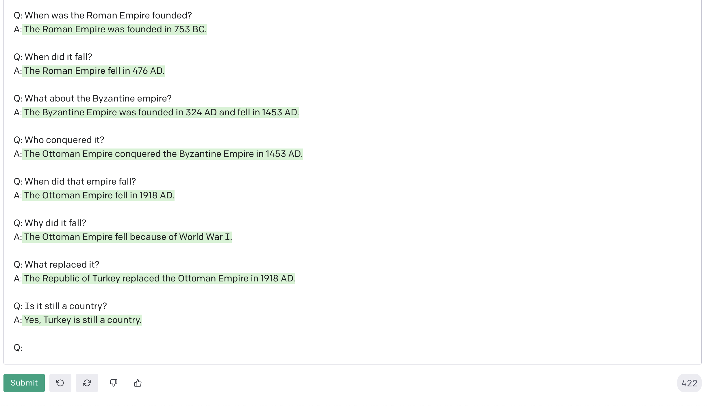

# [Prompt Me](https://poetic-zuccutto-0e3ba3.netlify.app/)

    
    
    
    

    
    

## Application Description

An app that uses GPT-3 to display results from a user's text prompts. This app is for my job application to Shopify's Autumn 2022 Internship.

## The Challenge

You will write an app that sends plain text prompts to the OpenAI API and displays the results in a list.

We'd like your app to have a simple-to-use interface that includes the following:

- A form for entering text prompts
- Submitting the form sends the prompt to the OpenAI API
- Results are displayed in a list, sorted from newest to oldest. Each result should include the original prompt and a response from the API.

## Technical Requirements

1. Results should come from OpenAI’s completions API, for which you’ll need a free API key (no credit card required).
   - We’ve provided screenshots below of demo apps we built using the OpenAI API.
   - We recommend using the “text-curie-001” AI engine which is a good balance between speed, cost, and accuracy.
   - You are free to use any front end framework/component library you like (or none at all!)
2. Each result should include at least the original prompt you entered and the response from the API.
3. Responses should be stored in order of newest to oldest.
4. The HTML that ends up being served client-side should be accessible and semantic

## My Workflow

The first thing I did was read The Challenge included in the job application. I opened all the links included and then some more on OpenAI's website. After I finished my doc reading, I did a run through of their demo app and playground. Really enjoyed asking the AI history questions and watch it follow along.

As I was reading through the docs, I was taking notes on how I'd like to create and deploy the app. I decided to create the app with React and deploy it on Netlify. Once those decisions were made, it was time to start working on the app. The first thing I want to do is get my API call working.
